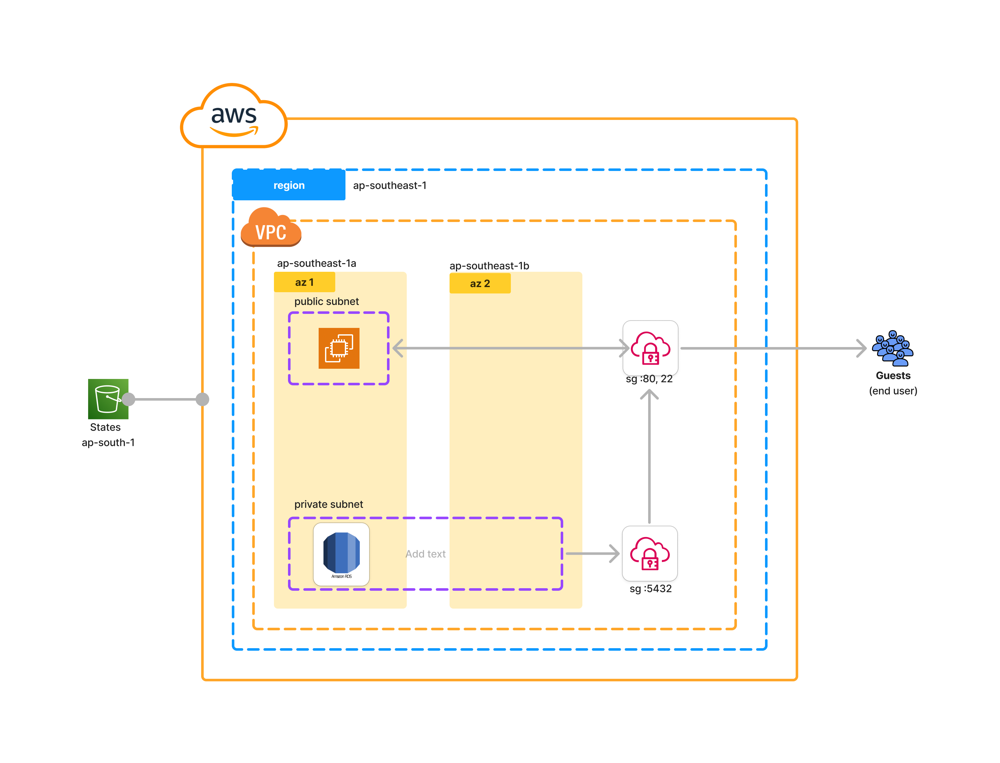

# DevOps QA
 
## Table of Contens

- [Change Control](#changecontrol2)
- [Theory Questions](#theoryquestions3)
- [Question 1](#question13)
- [Question 2](#question25)
- [Question 3](#question36)
- [Question 4](#question48)
- [Question 5](#question58)
- [Hands On](#handson9)
  - [1.1 Infrastructure Setup](#11infrastructuresetup9)
  - [1.2 Docker and Kubernetes:](#12dockerandkubernetes9)
- [Real-World Scenarios](#real-world-scenarios)
  - [Scenario 1](#scenario19)
  - [Scenario 2](#scenario29)

# Change Control

| Date | Comment | Author |
|---|---|---|
| 28/07/2024 | First Submission | Ashraf Minhaj |
||||


# Theory Questions

## Question1 

DevOps tools/techs I have used -

| Category | Tools/Tech |
|---|---|
| Cloud Provider | AWS, DigitalOcean |
| Infrastructure As Code | Terraform, Packer |
| Containerization | Docker |
| Container Orchestration Tool | RH OpenShift, Kubernetes, EKS, Fargate |
| Local Container Orchestration | Kind, k3s |
| Version Control | GitHub, GitLab |
| CI/CD | CircleCi, GitHub Actions, GitLab  |
| OS | Linux |
| Configuration Management | Ansible |
| Monitoring | Grafana, Jaeger, OpenTelemetry |
| Testing Automation | TerraTest, Selenium |
| Programming Language | Python |

Deployed projects to **DigitalOcean** and **AWS** with complete CI/CD pipeline with **GitLab, GitHub Actions** and **CircleCi**. Wrote **AWS** Infrastructures using **Terraform** and created **AMI** using **Packer**. Built and deployed **Docker**ized application to deploy to both the cloud providers, in AWS, used **EKS**, **Fargate** along with **ECR** for containerized application. In the local environment, setup **kind** and **k3s Kubernetes** clusters to test and play around with K8s. Setup servers with **Ansible**. Wrote codes using **Python**. Tested infrastructure using **Terratest**, automated manual works using **Selenium** and finally monitored metrics, bottlenecks, health, cost consumption etc. using **Grafana, Jaeger** and **OpenTelemetry**.

Currently working on **RedHat OpenShift Virtualization**, deployed Single Node and Multi Node clusters. Working on **Virtual Machine** deployment and migration from vmware. 

### Project example:

In a company, I had a task to create a custom video transcoder transmuxer.

So I designed the whole infrastructure using AWS services like Step Functions, Lambda, s3, CloudFront, ec2 and some other binaries like FFMEG and Shaka.
Wrote the whole infrastructure using Terraform, and Packer. GitHub was used as the version control tool, CircleCi being the CI/CD tool. And automated testing using Terratest was there which after applying the infra used to upload a file to test the output.

In another case, as our applications were increasing rapidly, the cost of ALB was getting very high. So I suggested using a central Load Balancer and using Host Based Routing. This reduced our cost significantly.  

Using GitHub Actions I created a custom Database Backup system. Instead of allocating a server, I picked GHA because we were already paying for it. A scheduled workflow runs at a predetermined time to backup Postgres and MongoDB database to s3 which had versioning enabled to help accidental data loss further.

Deployed containers to cloud providers like DigitalOcean AWS (ec2) using simple methods like SSH and SCP to automate legacy applications.

## Question2 
Write a step-by-step guide on how to set up a CI/CD pipeline using GitLab

**GitLab CI/CD:**

1. Setup secrets as variables in GitLab Variables

2. Create a ‘.gitlab-ci.yml’ file in the root of your repository.

3. Define ‘variables’, ‘jobs’ and then finally ‘Stages’, your jobs will be executed as they are listed in the stages section.


## Question3 

**Access Control:**

- For basic servers like DigitalOcean droplets, for each user we have to create a separate account adding them to a Group with certain constrained permissions like ‘Developer’ group, ‘Admin’ group or ‘Maintainer’ group etc.

- For cloud providers like AWS, we can create user specific IAM accounts, adding them to user-groups with strict policies. For developers, there is mostly no need for web-console access, only CLI access should be enough to create, deploy applications.

- Depending on company need/culture, we can create user groups by applications, or by roles.

- Developers will only have access to a feature/test environment where they can do whatever they want. But their accounts won’t have access to the production environment at all. It will be handled strictly by Admins and CI/CD pipelines.

- Additionally the company repositories, cloud accounts should only be accessible via VPN by specific users only.

- The credentials will be rotatable, meaning, the credentials will change every N days/weeks (depends on company).

- Developers will be able to push to feature branches only, moving codes to stage/main branches will be handled by only maintainers/admins.

**Data Protection:**

- The databases and secrets will be different for each environment.

- Developers will only have access to the dev database.

- No hard coded secret variables will be used in the code, rather they must be passed during run time. So, stage or production db credentials will also automatically be passed during deployment in CI/CD.

- A DB replica for production DB should be there, if the company budget allows.

- Frequent regular DB backup and retrieval systems should be there, to recover any accidental situation.

**Network Security:**

Some basic security policies are mostly enough to prevent threats -

- Strict security groups (for aws) allowing only certain ports that needed to go public.

- Using Web Application Firewall which enables us to add rules to prevent different types of bad requests.

- Keeping the frontend of the application only public, and keeping the backend or databases in private is the best.

Furthermore,

There’s something called AAA measures which means

- Authentication 	(prove identity),

- Authorization 	(permission) and

- Accounting 		(log an audit)

In simple words, our system should have a strict role based access control system which covers authentication and authorization. And we should always log to identify what actually went wrong.

Also during CI/CD, all source codes, including infrastructure codes must go through testing, having automated code testing is a leverage here. And no feature should move forward without strict testing in the stage environment by the QA team.

## Question4 

To stay updated with the latest development in the Cloud and DevOps technologies I do these -

1. Follow Community builders. The community builders, bloggers constantly talk about new findings of tools and techs, this helps me learn very fast and helps me stay updated.

2. I also follow authors of great books, people who make great tutorials or pioneers like Nana, Abhishek Veeramalla, Amir Hossain vai who is also a pioneer recently organised KCD BD.

3. On LinkedIn I follow DevOps and Cloud Leaders, who also talk about the latest things or scenarios.

4. I also read books to understand things from the basics. I like to read books particularly more than I like to view a 35 minute tutorial.

## Question5 

**Project experience with DataOps, MLOps, or AIOps:**

During my CloudOps days at ProgrammingHero I had to deploy a chatbot to aws. I helped the developer to create the dockerfile, optimised its size using a multi-stage dockerfile. I designed the infrastructure, wrote using Terraform and packer, and also added a complete CI/CD pipeline for it.

I also added a container monitoring tool that checks the health of the container running inside the EC2 and notifies the team via Discord message.

Deployed another application where it trains a model from a source db to a destination db and serves the prediction application.

##
# Hands On

## 1.1 Infrastructure Setup:

### Infrastructure Diagram


[files](1.1%20Infrastructure%20Setup/)

**Explanation:**
- The infrastructure is provisioned in region `ap-southeast-1` (Singapore) which is the cheapest for traffic transaction from Bangladesh. Public and Private Subnets are created in that.
- The infrastructure backend is s3, in the region `ap-south-1` (India). A completely different region is picked for disaster management, in case one region get's down, our infra state won't be affected which will help us instantly deploy the same infra again. The backend s3 bucket has versioning enabled for ensure further assurance.
- The `backend.env-slug.conf`, here `backend.dev.conf` file refers to the backend config file which tells Terraform which backend bucket and path to use. This should be hidden in real world repository and will be added during CI/CD.
- Sensitive variables are hidden using the `terraform.env-slug.tfvars` file, here `terraform.dev.tfvars`. In read world scenario we will add this file to `.gitignore` and this will be added during CI/CD via secrets management tools. By separating the variables we can just change the variables to deploy a completely new similar infrastructure which will be useful for stage testing.

> Note: Created two subnets. Because for DB Subnet groups, even with `multi_az=false` we have to add two subnets with multi az, [reference](https://stackoverflow.com/questions/63974936/db-subnet-group-doesnt-meet-availability-zone-coverage-requirement-please-add).

To further automate the proess and to make it easy to pass the variables I added automation scripts written in bash. Just run - `script.sh var_name` such as -
- `apply.sh dev` to init dev env
- `plan.sh dev` plan and
- `apply.sh dev` apply the infra

At the end, the script outputs the ec2 instane's public IP address so that you can just copy and see. 

And finally to destroy the whole infra -
- `destroy.sh dev`

## 1.2 Docker and Kubernetes:
The files can be found [here](1.2%20Docker%20and%20Kubernetes/)

Steps -
0. created the image from the dockerfile and pushed to a registry
1. created the `deployment.yaml` file that contains image informations, replica counts etc.
2. Additonally added a `service.yaml` file that exposes the pods running our application. Although this was not a requirement for the interview-test, it was added to test my codes work as they should be.
3. Added helm chart information, passed variables from the `values.yaml` file. 

**Deploy** -
1. create a namespace, don't use default namespaces.
2. to deploy the applicaton run being inside the [project directory](1.2%20Docker%20and%20Kubernetes/) -
   ```bash
   helm package hello-node
   helm install hello-node ./hello-node
   ```
**To update** -
1. edit files
2. apply the changes `helm upgrade hello-node ./hello-node`

> Note, this approach has it's own downside. Since in CI/CD it's not recommended to use push based configuratons, rather pull based deployment configurations using tools like ArgoCD that will monitor your repo and will deploy apps if change is found. That way you won't have to store your `kubeconfig` in your repo's secret. 

##
# Real-World Scenarios

## 2.1 Scaling and Performance:
